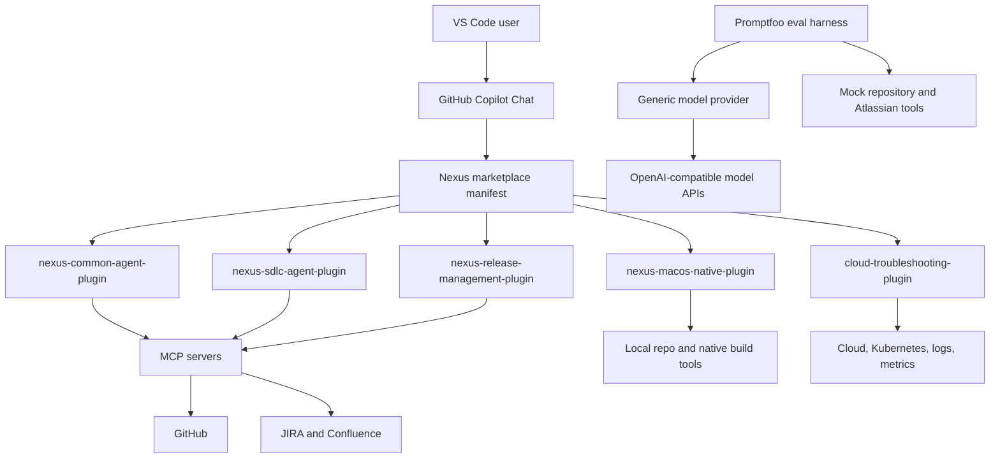
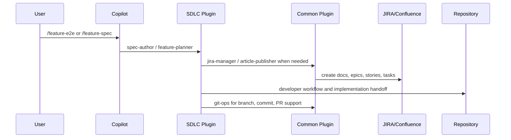
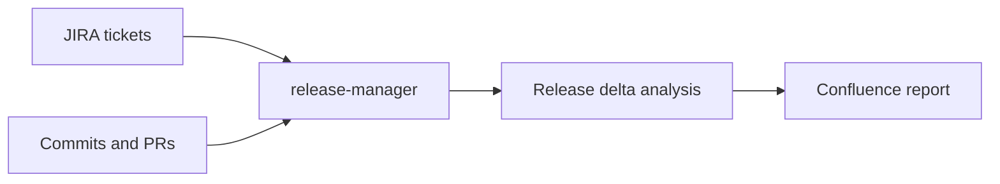

# Nexus Capability Architecture

> Date: 2026-05-12  
> Scope: Current Nexus-main marketplace, plugins, agents, commands, skills, eval provider, and Phase 0 validation harness

## 1. Positioning

Nexus is a VS Code + GitHub Copilot agent marketplace for engineering workflows. It is not a single application server. Its runtime model is a set of installable Copilot agent plugins that expose slash commands, specialized agents, reusable skills, instructions, and MCP tool access inside VS Code.

The current repository supports five installable plugins:

| Plugin | Commands | Agents | Skills | Primary Capability |
| --- | ---: | ---: | ---: | --- |
| `nexus-common-agent-plugin` | 5 | 5 | 6 | Shared Git, JIRA, Confluence, analysis, and Copilot asset operations |
| `nexus-sdlc-agent-plugin` | 15 | 9 | 10 | SDLC planning, architecture, implementation coordination, review, security, testing |
| `nexus-macos-native-plugin` | 3 | 2 | 13 | Native desktop build/test/scaffold workflows and platform knowledge |
| `nexus-release-management-plugin` | 4 | 2 | 2 | Release reporting, JIRA/GitHub correlation, and release delta analysis |
| `cloud-troubleshooting-plugin` | 4 | 4 | 10 | Cloud, Kubernetes, Docker, observability, and incident troubleshooting |

Current asset totals:

| Asset Type | Count |
| --- | ---: |
| Slash commands | 31 |
| Agents | 22 |
| Skills | 41 |
| Instruction files | 13 |
| Installable marketplace plugins | 5 |

## 2. Runtime Architecture



The marketplace entry point is `.github/plugin/marketplace.json`. Each plugin then resolves its own `.github/plugin/plugin.json`, command directory, agent directory, skill directory, and MCP server manifest.

## 3. Capability Map

### 3.1 Common Engineering Operations

Supported by `nexus-common-agent-plugin`.

| Capability | Entry Points | What It Supports |
| --- | --- | --- |
| Technical analysis | `/analyze`, `analyzer` | Classifies configs, logs, specs, screenshots, and other technical inputs, then routes to suitable specialists |
| Confluence/article publishing | `/article`, `article-publisher` | Creates or updates structured articles and technical reports |
| Copilot asset authoring | `/copilot-asset`, `prompt-engineer` | Creates, reviews, and validates commands, agents, skills, instructions, and eval assets |
| Git workflow operations | `/git`, `git-ops` | Branch creation, commit preparation, PR summary generation, workflow guidance |
| JIRA operations | `/jira`, `jira-manager` | Creates, updates, and lists JIRA issues such as bugs, stories, tasks, and epics |

Reusable skills include analysis frameworks, git workflow conventions, prompt techniques, Copilot asset validation, Copilot asset workflow guidance, and promptfoo eval guidance.

### 3.2 SDLC Delivery Workflows

Supported by `nexus-sdlc-agent-plugin`.

| Capability | Entry Points | What It Supports |
| --- | --- | --- |
| Intelligent routing | `/start`, `/help`, `router` | Maps user intent to the right command, agent, or workflow |
| Project initialization | `/project-init`, `dev-coordinator` | Bootstraps development work with repository and JIRA context |
| Feature specification | `/feature-spec`, `spec-author` | Turns requirements or notes into structured feature specifications |
| Feature planning | `/feature-plan`, `feature-planner` | Converts specs into JIRA hierarchy and story breakdowns |
| Feature E2E delivery | `/feature-e2e` | Chains feature idea/spec planning through JIRA story creation and implementation handoff |
| Task implementation | `/task`, `dev-coordinator`, `developer` | Coordinates JIRA context, branch setup, task files, implementation, tests, and handoff |
| Bug investigation | `/bugfix`, `bugfix` | Investigates bug context, builds hypotheses, and hands implementation work to developer workflows |
| Architecture work | `/architecture`, `/architecturemd`, `architect` | Produces architecture docs, diagrams, ADRs, and system documentation |
| AGENTS.md generation | `/agentsmd` | Generates or updates repository agent guidance |
| Code review | `/code-review` | Reviews code changes for correctness, maintainability, and risk |
| Security review | `/security`, `security-engineer` | Applies security review patterns, threat modeling, and remediation guidance |
| Test strategy | `/test`, `/feature-testplan`, `feature-testplan-author` | Produces test strategy, feature test plans, and QA guidance |

Reusable skills cover ADR generation, C4 diagrams, code review, code submission, epic/story workflow, JIRA context discovery, repository context discovery, security review, test strategy, and threat modeling.

Current maturity note: `/feature-e2e` exists. `/epic-e2e`, `/bugfix-e2e`, and `/autotest-e2e` are not standalone commands yet; their building blocks exist, but the explicit command entry points and resumable orchestration state still need to be added.

### 3.3 Native Desktop Development

Supported by `nexus-macos-native-plugin`.

| Capability | Entry Points | What It Supports |
| --- | --- | --- |
| Native build workflow | `/xcode-build`, `build-engineer` | Build command planning, build failure diagnosis, dependency/build-system guidance |
| Native test workflow | `/xcode-test`, `build-engineer` | Test execution planning, result interpretation, test runner guidance |
| Integration channel scaffolding | `/vc-scaffold`, `vc-developer` | Scaffolds or guides extension/integration channel implementation patterns |
| Native platform knowledge | `vc-developer`, skills | API patterns, interop, crash analysis, dependency management, CI, quality tooling |

Reusable skills include build execution, test runner usage, build error diagnosis, native API patterns, interop patterns, test patterns, virtual channel SDK/scaffold knowledge, dependency management, CI, crash log analysis, quality checks, and design document templates.

Current maturity note: this plugin is strong as an expert-guidance and workflow layer. Some capabilities still depend on the user workspace having the actual native toolchain and project scripts available.

### 3.4 Release Management

Supported by `nexus-release-management-plugin`.

| Capability | Entry Points | What It Supports |
| --- | --- | --- |
| Completed work reporting | `/jira-completed-by-assignee` | Finds completed JIRA work by assignee and reporting window |
| JIRA/GitHub traceability | `/github-jira-commit-linkage`, `jira-github-report-analyzer` | Links JIRA keys to commits and PRs |
| Epic enrichment | `/jira-epic-enrichment` | Adds Epic context to JIRA issue lists |
| Confluence report publishing | `/confluence-publish-report` | Publishes release or completion reports to Confluence |
| Release delta analysis | `release-manager`, skills | Compares release branches or ticket sets and identifies change deltas |

Reusable skills include bug-fix branch discovery and release delta analysis.

Current maturity note: the plugin supports release reporting and traceability. Full release readiness scoring, release note drafting, and evidence completeness checks are planned but not yet implemented as first-class commands.

### 3.5 Cloud and Incident Troubleshooting

Supported by `cloud-troubleshooting-plugin`.

| Capability | Entry Points | What It Supports |
| --- | --- | --- |
| SRE triage | `/sre`, `sre` | Kubernetes cluster and workload diagnostics, event collection, incident triage |
| Alert triage | `/cloud-alert-triage`, `cloud-alert-triage` | Turns alerts into severity, likely cause, evidence, and next actions |
| Service troubleshooting | `/service-troubleshoot`, `service-troubleshoot` | Investigates service errors, latency, crashes, dependencies, and connectivity |
| Infrastructure troubleshooting | `/cloud-infra-troubleshoot`, `cloud-infra-troubleshoot` | Diagnoses cloud infrastructure, nodes, networks, storage, and container runtime issues |
| Observability support | skills | Prometheus/Grafana, Loki, Splunk query construction, log analysis, dependency tracing |

Reusable skills cover Kubernetes pod diagnostics, Kubernetes cluster diagnostics, Docker/container diagnostics, Prometheus alert analysis, Loki log analysis, network connectivity diagnostics, cloud health checks, service dependency tracing, Splunk query building, and Splunk connectivity testing.

Current maturity note: the plugin provides a broad incident-response surface. Real production usefulness depends on MCP/tool connectivity to Kubernetes, cloud APIs, and observability systems.

## 4. Cross-Cutting Capabilities

### 4.1 Marketplace Deployment

Nexus now supports a marketplace-first deployment model:

- Root marketplace registry: `.github/plugin/marketplace.json`
- Per-plugin manifests: `plugins/*/.github/plugin/plugin.json`
- Installable plugin assets: `commands/`, `agents/`, `skills/`, `.mcp.json`
- Phase 0 validation command: `npm run phase0`
- CI validation workflow: `.github/workflows/phase0-validation.yml`

The validation flow checks marketplace registration, manifest fields, asset paths, frontmatter, agent handoffs, eval prompt paths, runtime dependencies, and eval provider importability.

### 4.2 Model Provider Abstraction

The eval provider supports environment-driven model selection. Agent execution and grader execution can use separate model configurations.

Supported provider families:

- `openai`
- `deepseek`
- `openrouter`
- `gemini`
- `ollama`

All eval calls use the generic OpenAI-compatible chat completions client. Teams configure model tokens, model names, and optional base URLs through environment variables.

Configuration is maintained through shell environment variables or `eval/providers/.env`, with examples in `eval/providers/.env.example`.

### 4.3 Eval and Quality Harness

The eval system is based on promptfoo and a combined provider that can:

- Load Copilot prompt files from plugin command assets.
- Use mock repository tools.
- Use mock Atlassian/JIRA/Confluence data.
- Run provider smoke tests without making a live model API call.
- Run plugin-specific eval suites under `eval/tests/`.

Current coverage is strongest for common and SDLC workflows. Native desktop, release management, and cloud troubleshooting need broader eval suites.

### 4.4 MCP and External Systems

The architecture expects MCP access for external systems, especially:

- GitHub for repositories, commits, PRs, issues, and code search.
- Atlassian for JIRA and Confluence workflows.
- Optional cloud, Kubernetes, observability, and analytics systems for troubleshooting and reporting.

The current repository includes MCP manifests and sample configuration patterns, but real external access depends on user environment, credentials, and MCP server availability.

## 5. Primary User Journeys

### 5.1 Feature Delivery



### 5.2 Bugfix Delivery

```mermaid
flowchart LR
    Bug[JIRA bug or user report] --> Bugfix[/bugfix]
    Bugfix --> Analysis[Root cause analysis]
    Analysis --> Task[Implementation task]
    Task --> Dev[developer]
    Dev --> Security[security-engineer]
    Dev --> Git[git-ops]
    Git --> PR[Pull request]
```

Current note: `/bugfix` exists. The fully chained `/bugfix-e2e` command is still planned.

### 5.3 Incident Troubleshooting

```mermaid
flowchart TD
    Alert[Alert or incident] --> Triage[/cloud-alert-triage or /sre]
    Triage --> K8s[Kubernetes diagnostics]
    Triage --> Logs[Logs and metrics]
    Triage --> Network[Network and dependency checks]
    Triage --> RCA[RCA and mitigation plan]
```

### 5.4 Release Reporting



## 6. Supported Capability Summary

| Area | Current Support Level | Notes |
| --- | --- | --- |
| Marketplace installability | Strong | 5 plugins registered and Phase 0 validation exists |
| Shared Git/JIRA/Confluence ops | Strong | Common plugin provides reusable command and agent layer |
| Copilot asset authoring | Strong | Asset creation/review/validation workflow exists |
| Feature spec and planning | Strong | Spec, planning, JIRA hierarchy, and feature E2E path exist |
| General task execution | Medium-strong | Developer/coordinator flow exists; depends on repo-specific context |
| Bugfix workflow | Medium | `/bugfix` exists; `/bugfix-e2e` is planned |
| Test strategy | Medium | Test planning exists; automated test implementation E2E is planned |
| Security review | Medium-strong | Security agent and review skills exist; broader prompt-injection evals are planned |
| Native build/test | Medium | Good expert workflow support; actual execution depends on local project/toolchain |
| Release reporting | Medium | Traceability and reports exist; readiness scoring is planned |
| Cloud troubleshooting | Medium | Broad diagnostic skills exist; real value depends on live MCP/tool connectivity |
| Eval coverage | Medium | Common/SDLC coverage exists; native/release/cloud coverage should expand |
| Model provider generalization | Strong | Generic provider and grader configuration exist |
| Privacy/redaction governance | Early | Identified as a needed capability, not yet complete |
| Repository intelligence | Early-medium | Discovery skill exists; generated reusable repo profile is still planned |

## 7. Current Gaps

The biggest remaining gaps are not basic plugin structure. They are orchestration depth, external connectivity validation, and quality measurement.

| Gap | Impact | Recommended Next Step |
| --- | --- | --- |
| `/epic-e2e`, `/bugfix-e2e`, `/autotest-e2e` missing as standalone commands | Users cannot start those full workflows from one stable entry point | Add command assets and shared workflow state template |
| Native/release/cloud eval coverage is thin | Prompt changes can regress without automated detection | Add smoke and workflow eval suites for each plugin |
| Repository intelligence is not persisted | Agents may rescan or miss repo-specific context | Add generated repo context pack or `AGENTS.generated.md` workflow |
| MCP health checks are limited | Agents may promise tool use before credentials/connectivity are ready | Add MCP connectivity check command or runtime script |
| Privacy/redaction controls are early | Logs, tickets, crash data, and reports may expose sensitive fields | Add privacy-redaction skill and prompt-injection evals |
| Release readiness is mostly reporting | Release decisions still need manual synthesis | Add release readiness score and evidence completeness checks |

## 8. Architecture Principles

1. Keep plugins independently installable through the VS Code marketplace flow.
2. Keep common workflows in `nexus-common-agent-plugin`; avoid duplicating Git/JIRA/Confluence logic in specialized plugins.
3. Treat commands as user-facing entry points, agents as workflow executors, skills as reusable domain knowledge, and instructions as cross-cutting rules.
4. Validate marketplace assets before publishing, using `npm run phase0`.
5. Keep private credentials in environment variables or local `.env` files, never in checked-in manifests or eval configs.
6. Expand eval coverage before adding high-risk autonomous workflows.
7. Prefer explicit handoff summaries and acceptance gates for long-running SDLC flows.

## 9. Bottom Line

Nexus currently supports a broad engineering agent marketplace: shared operations, SDLC delivery, native desktop workflows, release reporting, cloud troubleshooting, generic eval providers, and Phase 0 marketplace validation. Its strongest areas are marketplace packaging, common engineering operations, feature planning, and SDLC orchestration. Its next growth area is turning partial workflows into resumable E2E commands and making eval/observability coverage strong enough for wider team adoption.
