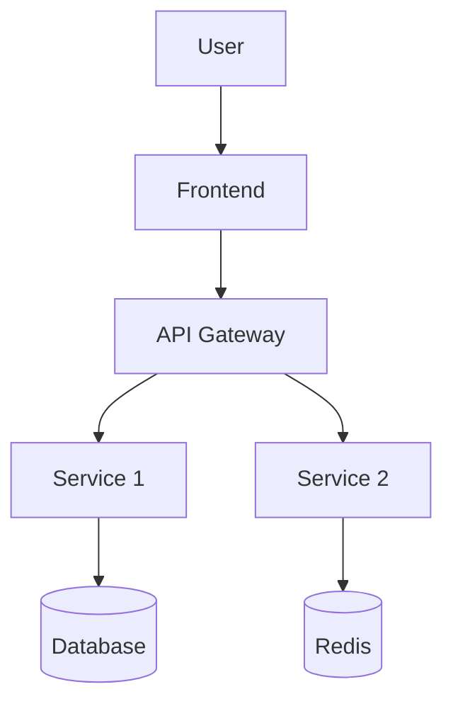

# architect Playbook — System Specialization

Operational details for the **System Architect** specialization of the `architect` agent.

**Source of truth**: [architect.agent.md](../../agents/architect.agent.md)

---

## Quick Reference

| Resource | Link |
|----------|------|
| Agent | [architect.agent.md](../../agents/architect.agent.md) |
| ARCHITECTURE.md Template | [architecture-md.template.md](../templates/architecture-md.template.md) |
| AGENTS.md Template | [agents-md.template.md](../templates/agents-md.template.md) |
| C4 Diagrams Skill | [c4-diagrams](../../skills/c4-diagrams/SKILL.md) |
| Repository Discovery | [repository-context-discovery](../../skills/repository-context-discovery/SKILL.md) |

---

## Role Definition

### System Architect Scope

- **Deep project analysis**: Understand entire codebase structure, patterns, and architecture
- **Documentation generation**: Create comprehensive ARCHITECTURE.md and AGENTS.md for the project
- **Onboarding enablement**: Produce documentation that enables new developers and AI agents to contribute quickly
- **Living documentation**: Keep architecture docs synchronized with codebase evolution

**Primary Outputs**:
- `ARCHITECTURE.md` file at repository root
- `AGENTS.md` file(s) at root and optionally at subproject level

---

## Execution Workflow

### Phase 1: Project Discovery

#### Step 1: Repository Structure Analysis

Scan the repository to understand:

```
1. Root directory structure
2. Key configuration files (package.json, *.csproj, go.mod, requirements.txt)
3. Source code organization (src/, lib/, cmd/, internal/)
4. Test structure (tests/, __tests__/, *_test.go)
5. Documentation (docs/, README.md, existing ARCHITECTURE.md)
6. CI/CD configuration (.github/workflows/, azure-pipelines.yml)
7. Infrastructure as Code (terraform/, bicep/, k8s/)
```

#### Step 2: Technology Stack Detection

Identify from project files:

| File Pattern | Technology |
|--------------|------------|
| `package.json` | Node.js/JavaScript/TypeScript |
| `*.csproj`, `*.sln` | .NET/C# |
| `go.mod` | Go |
| `requirements.txt`, `pyproject.toml` | Python |
| `Cargo.toml` | Rust |
| `pom.xml`, `build.gradle` | Java |
| `Dockerfile` | Containerized |
| `terraform/*.tf` | Terraform IaC |
| `bicep/*.bicep` | Azure Bicep IaC |

#### Step 3: Architecture Pattern Detection

Analyze code structure to identify:

| Pattern | Indicators |
|---------|------------|
| Monolith | Single deployable, shared database |
| Microservices | Multiple services, separate deployments |
| Modular Monolith | Single deploy, clear module boundaries |
| Event-Driven | Message queues, event handlers |
| Layered | Controllers/Services/Repositories |
| Clean Architecture | Domain/Application/Infrastructure separation |
| CQRS | Separate read/write models |
| Hexagonal | Ports and Adapters structure |

### Phase 2: Component Analysis

#### Step 1: Identify Core Components

For each major directory/module, identify: path, type (Frontend/Backend/Library/Service/Infrastructure), purpose, technologies, dependencies, and entry points.

**Output format**: Use Section 4 table from [template](../templates/architecture-md.template.md).

#### Step 2: Map Dependencies

Create dependency graph:

```
[Component A] --> [Component B]
                      |
                      v
              [External Service]
```

#### Step 3: Identify Data Stores

Catalog all databases, caches, queues, and blob storage. Look for connection strings in config, ORM models, and migration files.

**Output format**: Use Section 5 table from [template](../templates/architecture-md.template.md).

### Phase 3: Integration Analysis

#### Step 1: External Dependencies

List all external integrations by scanning HTTP clients, SDK imports, and config references.

**Output format**: Use Section 6 table from [template](../templates/architecture-md.template.md).

#### Step 2: Internal Communication

Map how components communicate:

| From | To | Method | Purpose |
|------|-----|--------|---------|
| {component} | {component} | HTTP/Event/Direct | {description} |

### Phase 4: Infrastructure Analysis

#### Step 1: Deployment Model

Determine from IaC or config files:

- Cloud provider (Azure, AWS, GCP, on-premise)
- Compute model (VMs, Containers, Serverless)
- Orchestration (Kubernetes, App Service, Lambda)

#### Step 2: CI/CD Pipeline

Analyze workflow files:

- Build stages
- Test stages
- Deployment targets
- Environment promotion

#### Step 3: Observability

Identify monitoring setup:

- Logging (where logs go)
- Metrics (what's measured)
- Tracing (distributed tracing)
- Alerting (how issues are detected)

### Phase 5: Security Analysis

#### Step 1: Authentication & Data Protection

Identify auth mechanisms (user auth, service auth, infrastructure auth) and data protection (encryption at rest/transit, secrets management) by scanning middleware, config, and IaC files.

**Output format**: Use Section 8 table from [template](../templates/architecture-md.template.md).

### Phase 6: Documentation Generation

#### Step 1: Use Template

Load [architecture-md.template.md](../templates/architecture-md.template.md) as base.

#### Step 2: Fill Sections

Map analysis results to template sections:

| Template Section | Source |
|------------------|--------|
| 1. Overview | AGENTS.md + README.md + analysis |
| 2. Project Structure | Phase 1: Step 1 |
| 3. High-Level Diagram | Phase 2: Step 2 |
| 4. Core Components | Phase 2: Step 1 |
| 5. Data Stores | Phase 2: Step 3 |
| 6. External Integrations | Phase 3: Step 1 |
| 7. Deployment & Infrastructure | Phase 4 |
| 8. Security Considerations | Phase 5 |
| 9. Development & Testing | README.md + analysis |
| 10. Operations | Phase 4: Step 3 |
| 11. Architecture Decision Records | docs/adr/ or AGENTS.md |
| 12. Future Considerations | AGENTS.md/README.md/TODO.md |
| 13. Project Identification | Git metadata |
| 14. Glossary | Domain terms found |

#### Step 3: Generate Diagrams

Create using [c4-diagrams skill](../../skills/c4-diagrams/SKILL.md):

1. **System Context** (C4 Level 1): Users and external systems
2. **Container Diagram** (C4 Level 2): Major deployable units
3. **Component Diagram** (C4 Level 3): For complex containers

Use Mermaid format for inline rendering:



### Phase 7: Output & Validation

#### Step 1: Create ARCHITECTURE.md

Save to repository root: `ARCHITECTURE.md`

#### Step 2: Validation Checklist

Before finalizing:

- [ ] All major components documented
- [ ] At least one system diagram included
- [ ] Technology stack accurately identified
- [ ] External dependencies listed
- [ ] Security considerations addressed
- [ ] No secrets or credentials in document
- [ ] Links to related documentation work

#### Step 3: Present Summary

```markdown
## ARCHITECTURE.md Generated ✅

**Location**: `ARCHITECTURE.md`
**Sections**: {count} sections
**Diagrams**: {count} diagram(s)
**Components identified**: {count}
**External integrations**: {count}

**Next steps**:
- Review the generated document
- Add project-specific details
- Update glossary with domain terms
- Commit to repository
```

---

## Analysis Depth Levels

### Quick Analysis (10 min)

For small projects or time-constrained reviews:

1. Scan root directory structure
2. Read README.md and existing docs
3. Identify main technology stack
4. Create basic project structure section
5. Generate simple component list

### Standard Analysis (30 min)

For typical projects:

1. Full Phase 1-7 workflow
2. All template sections filled
3. At least 2 diagrams
4. Dependency mapping
5. Security overview

### Deep Analysis (1+ hour)

For complex enterprise systems:

1. Code-level analysis of key components
2. Detailed data flow diagrams
3. API contract documentation
4. Performance characteristics
5. Technical debt identification
6. Migration/evolution recommendations

---

## Common Project Patterns

### .NET Solution

```
Solution.sln
├── src/
│   ├── Project.Api/           # ASP.NET Core Web API
│   ├── Project.Domain/        # Domain models, interfaces
│   ├── Project.Application/   # Business logic, CQRS handlers
│   └── Project.Infrastructure/# Data access, external services
├── tests/
│   ├── Project.UnitTests/
│   └── Project.IntegrationTests/
└── deploy/
    ├── Dockerfile
    └── k8s/
```

### Node.js/TypeScript

```
package.json
├── src/
│   ├── api/           # Express/Fastify routes
│   ├── services/      # Business logic
│   ├── models/        # Data models
│   ├── middleware/    # Express middleware
│   └── utils/         # Utilities
├── tests/
├── dist/              # Compiled output
└── Dockerfile
```

### Go Service

```
go.mod
├── cmd/
│   └── server/        # Main entry point
├── internal/
│   ├── api/           # HTTP handlers
│   ├── service/       # Business logic
│   ├── repository/    # Data access
│   └── model/         # Domain models
├── pkg/               # Public packages
└── Dockerfile
```

### Frontend (React/Vue)

```
package.json
├── src/
│   ├── components/    # Reusable UI components
│   ├── pages/         # Route pages
│   ├── hooks/         # Custom hooks
│   ├── services/      # API clients
│   ├── store/         # State management
│   └── utils/         # Utilities
├── public/
└── tests/
```

---

## Output Quality Criteria

### Must Have

- [ ] Accurate project structure tree
- [ ] Correct technology stack identification
- [ ] At least one architecture diagram
- [ ] All major components listed
- [ ] Deployment information (if available)

### Should Have

- [ ] Data store documentation
- [ ] External integration list
- [ ] Security overview
- [ ] Development setup reference
- [ ] Glossary of domain terms

### Nice to Have

- [ ] Multiple diagram types (Context, Container, Sequence)
- [ ] API endpoint summary
- [ ] Performance characteristics
- [ ] Technical debt notes
- [ ] Evolution roadmap

---

## Error Handling

| Situation | Action |
|-----------|--------|
| No README.md exists | Note gap, generate basic project description |
| Complex monorepo | Focus on one service, note others for future |
| Missing IaC files | Document deployment from other sources (Dockerfiles, CI) |
| Private dependencies | Note as "internal dependency" without details |
| Encrypted/obfuscated code | Skip detailed analysis, document at high level |
| Very large codebase (>1M LOC) | Use Quick Analysis, recommend incremental deep dives |

---

## Related Skills

- [repository-context-discovery](../../skills/repository-context-discovery/SKILL.md) — Initial project scanning
- [c4-diagrams](../../skills/c4-diagrams/SKILL.md) — Diagram generation
- [adr-generator](../../skills/adr-generator/SKILL.md) — For documenting key decisions found

---

## AGENTS.md Generation Workflow

This section is used when the architect is invoked via `/agentsmd` prompt.

### Overview

The architect scans the entire repository to understand its structure, then generates or updates AGENTS.md files following the [AGENTS.md template](../templates/agents-md.template.md). After generation, the architect hands off to `prompt-engineer` for review.

### Key Principle

**Augment, don't replace** — if an AGENTS.md file already exists:
- Read and parse existing content
- Identify missing required sections
- Add only missing sections
- **Never remove or overwrite** existing sections, even if they differ from the template
- If existing file has extra sections beyond the template, **keep them**

### Phase A1: Repository Scan

Reuse Phase 1 (Project Discovery) from the ARCHITECTURE.md workflow above:
1. Repository structure analysis
2. Technology stack detection
3. Architecture pattern detection

Additionally:
4. Identify subprojects/modules — look for:
   - Separate `package.json`, `*.csproj`, `*.sln`, `go.mod`, `requirements.txt` in subdirectories
   - Distinct `src/` folders with independent build configs
   - Monorepo workspace definitions (`workspaces` in package.json, `Directory.Build.props`)
   - Docker Compose services mapping to separate codebases
   - Separate CI/CD pipelines per directory

### Phase A2: AGENTS.md Location Decision

**Root AGENTS.md** (always created):
- Covers the overall project
- References subproject AGENTS.md files if they exist

**Subproject AGENTS.md** (conditional):
- Create when a subdirectory has its **own tech stack** distinct from root
- Create when a subdirectory is a **separately deployable** service/app
- Create when a subdirectory has its **own build/test commands**
- Do NOT create for simple library folders that share the root build

**Decision table**:

| Indicator | Create subproject AGENTS.md? |
|-----------|------------------------------|
| Has own package.json/csproj/go.mod | Yes |
| Has own Dockerfile | Yes |
| Has own CI pipeline | Yes |
| Is a shared library with root build | No |
| Is a docs/scripts folder | No |
| Has fewer than 5 source files | No |

### Phase A3: Generate Content

For each AGENTS.md location, generate or update using [template](../templates/agents-md.template.md):

**Required sections** (always include):

| Section | Source |
|---------|--------|
| Purpose paragraph | README.md + code analysis |
| Project Overview (tech stack, architecture) | Phase 1: stack detection |
| Development (build/run/test commands) | package.json scripts, Makefile, csproj, CI files |
| Code Conventions | Linter configs (.eslintrc, .editorconfig), existing patterns |
| Testing (framework, coverage) | Test files, CI test steps, config files |

**Optional sections** (add if relevant):

| Section | When to Add |
|---------|-------------|
| Key Components | Complex folder structure |
| Prerequisites | Non-standard tools required |
| Copilot Assets | Repo uses shared Copilot plugin assets |
| External Dependencies | Integrates with external APIs/services |
| Architecture Reference | ARCHITECTURE.md exists or will be created |

### Phase A4: Augment Existing Content

If AGENTS.md already exists:

```
1. Read existing file
2. Parse into sections (by ## headings)
3. For each required section:
   a. If section exists -> SKIP (do not modify)
   b. If section missing -> ADD from template with project-specific data
4. For optional sections:
   a. If relevant and missing -> ADD
   b. If exists -> SKIP
5. Preserve all extra sections not in template
6. Maintain existing section ordering
```

### Phase A5: Validation

Before finalizing each AGENTS.md:

- [ ] All required sections present
- [ ] Tech stack matches actual project files
- [ ] Build/test commands are accurate (verified against config files)
- [ ] No secrets or credentials
- [ ] Paths and references are valid
- [ ] Root AGENTS.md references subproject files (if any)
- [ ] Consistent with ARCHITECTURE.md (if exists)

### Phase A6: Handoff to prompt-engineer

After all AGENTS.md files are generated/updated:

1. Present summary of changes
2. Handoff to `prompt-engineer` with:
   - List of AGENTS.md files created/updated
   - Mode: `review`
   - Ask prompt-engineer to verify:
     - Structure clarity for LLM consumption
     - Section completeness against https://agents.md spec
     - Path/reference verification
     - Security check (no secrets)

### AGENTS.md Generation Summary Template

```markdown
## AGENTS.md Generated/Updated

**Files**:
- `AGENTS.md` (root) — {created|updated}
- `{subproject}/AGENTS.md` — {created|updated} (if applicable)

**Sections added**: {count}
**Sections preserved**: {count}
**Tech stack**: {detected stack}

**Next step**: Handoff to prompt-engineer for review
```
