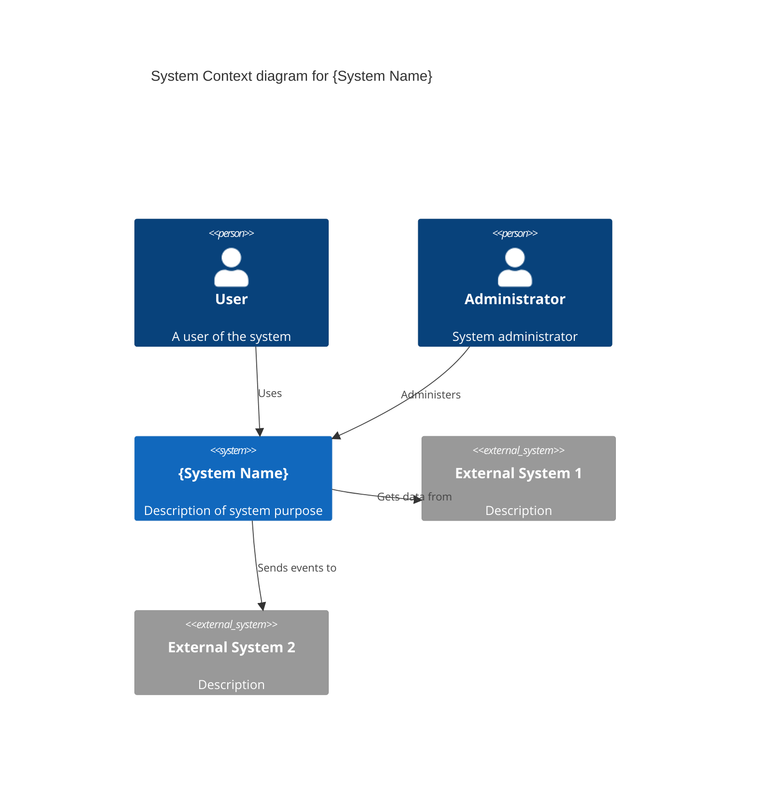

# C4 Diagrams Skill

## When to Use
- New system architecture documentation
- Architecture review presentations
- Developer onboarding materials
- Technical specification documents
- System integration planning

## C4 Model Levels

| Level | Purpose | Audience | Detail |
|-------|---------|----------|--------|
| 1. Context | System in environment | Everyone | Very high |
| 2. Container | Applications & data stores | Technical | High |
| 3. Component | Components inside containers | Developers | Medium |
| 4. Code | Class/module level | Developers | Low |

**Most common**: Levels 1-3. Level 4 rarely needed (use IDE/tooling instead).

## Workflow

### Step 1: Gather System Information

Ask user for:
```markdown
1. System name and purpose
2. Key users/actors
3. External systems it integrates with
4. Main applications/services
5. Databases and storage
6. (Optional) Key components within services
```

### Step 2: Generate Level 1 - Context Diagram

Shows the system as a box, surrounded by users and external systems.

**PlantUML Format**:
```plantuml
@startuml
!include https://raw.githubusercontent.com/plantuml-stdlib/C4-PlantUML/master/C4_Context.puml

title System Context diagram for {System Name}

Person(user, "User", "A user of the system")
Person(admin, "Administrator", "System administrator")

System(system, "{System Name}", "Description of system purpose")

System_Ext(extSystem1, "External System 1", "Description")
System_Ext(extSystem2, "External System 2", "Description")

Rel(user, system, "Uses", "HTTPS")
Rel(admin, system, "Administers", "HTTPS")
Rel(system, extSystem1, "Gets data from", "REST API")
Rel(system, extSystem2, "Sends events to", "AMQP")

@enduml
```

**Mermaid Format**:


**ASCII Format** (for Markdown/text) — use pure ASCII only (`+`, `-`, `|`, `>`, `v`), never Unicode box-drawing:
```
                              +-----------------+
                              |      User       |
                              |   (End User)    |
                              +--------+--------+
                                       | HTTPS
                                       v
+-----------------+         +---------------------+         +-----------------+
|  External       |<------->|   {System Name}     |<------->|  External       |
|  System 1       | REST    |                     |  AMQP   |  System 2       |
|                 |         |   {Description}     |         |                 |
+-----------------+         +---------------------+         +-----------------+
                                       ^
                                       | HTTPS
                              +--------+--------+
                              |  Administrator  |
                              |   (Admin)       |
                              +-----------------+
```

### Step 3: Generate Level 2 - Container Diagram

Shows the containers (applications, services, databases) that make up the system.

**PlantUML Format**:
```plantuml
@startuml
!include https://raw.githubusercontent.com/plantuml-stdlib/C4-PlantUML/master/C4_Container.puml

title Container diagram for {System Name}

Person(user, "User", "A user of the system")

System_Boundary(system, "{System Name}") {
    Container(webApp, "Web Application", "React", "Provides user interface")
    Container(api, "API Application", "ASP.NET Core", "Provides REST API")
    Container(worker, "Background Worker", ".NET", "Processes async jobs")
    ContainerDb(db, "Database", "PostgreSQL", "Stores data")
    ContainerQueue(queue, "Message Queue", "RabbitMQ", "Async messaging")
}

System_Ext(extSystem, "External System", "Third party service")

Rel(user, webApp, "Uses", "HTTPS")
Rel(webApp, api, "Makes API calls to", "HTTPS/JSON")
Rel(api, db, "Reads/Writes", "TCP/SQL")
Rel(api, queue, "Publishes to", "AMQP")
Rel(worker, queue, "Subscribes to", "AMQP")
Rel(worker, db, "Reads/Writes", "TCP/SQL")
Rel(api, extSystem, "Calls", "HTTPS")

@enduml
```

**ASCII Format** — pure ASCII only:
```
+-----------------------------------------------------------------------------+
|                              {System Name}                                   |
|  +-------------+    +-------------+    +-------------+    +-------------+  |
|  | Web App     |    |   API       |    |  Worker     |    |   Cache     |  |
|  | [React]     |--->| [.NET Core] |--->| [.NET]      |    |  [Redis]    |  |
|  |             |    |             |    |             |    |             |  |
|  +-------------+    +------+------+    +------+------+    +-------------+  |
|                            |                  |                   ^         |
|                            |                  |                   |         |
|                            v                  v                   |         |
|                     +-------------+    +-------------+            |         |
|                     |  Database   |    |   Queue     |------------+         |
|                     | [PostgreSQL]|    | [RabbitMQ]  |                      |
|                     +-------------+    +-------------+                      |
+-----------------------------------------------------------------------------+
```

### Step 4: Generate Level 3 - Component Diagram

Shows the components inside a specific container.

**PlantUML Format**:
```plantuml
@startuml
!include https://raw.githubusercontent.com/plantuml-stdlib/C4-PlantUML/master/C4_Component.puml

title Component diagram for API Application

Container_Boundary(api, "API Application") {
    Component(controllers, "Controllers", "ASP.NET Core", "REST endpoints")
    Component(services, "Services", "C#", "Business logic")
    Component(repositories, "Repositories", "C#", "Data access")
    Component(validators, "Validators", "FluentValidation", "Input validation")
    Component(mappers, "Mappers", "AutoMapper", "DTO mapping")
}

ContainerDb(db, "Database", "PostgreSQL", "Stores data")
Container_Ext(extApi, "External API", "Third party")

Rel(controllers, validators, "Validates with")
Rel(controllers, services, "Uses")
Rel(services, repositories, "Uses")
Rel(services, mappers, "Maps with")
Rel(repositories, db, "Reads/Writes")
Rel(services, extApi, "Calls")

@enduml
```

### Step 5: Choose Output Format

| Format | Best For | Tooling |
|--------|----------|---------|
| PlantUML | CI/CD generation, version control | PlantUML server, IDE plugins |
| Mermaid | GitHub/GitLab Markdown | Native rendering |
| Structurizr | Interactive docs, Structurizr workspace | Structurizr Lite/Cloud |
| ASCII | Universal compatibility, PRs | Any text editor |

### Step 6: Output Diagram Document

For each level, output: diagram in chosen format, key relationships table (From/To/Description/Protocol), container/component inventory table.

## Structurizr DSL Format

For complex architectures, use Structurizr DSL with `model {}` (persons, software systems, containers, components, relationships) and `views {}` (systemContext, container, component with autoLayout). See [Structurizr DSL reference](https://docs.structurizr.com/dsl/language).

## Best Practices

1. **Start with Context** — Always create Level 1 first
2. **Zoom in as needed** — Not every system needs Level 3
3. **Keep it updated** — Diagrams as code in version control
4. **Use consistent notation** — Same shapes/colors across diagrams
5. **Add legends** — Explain custom notation
6. **Link diagrams** — Reference lower levels from higher levels

## Integration with Architect Agent

When generating C4 diagrams:
1. Reference [architect playbooks](../../agent-assets/architect/) for architecture context
2. Use output in [ADRs](../adr-generator/SKILL.md) for decision documentation
3. Include in threat models from [threat-modeling skill](../threat-modeling/SKILL.md)
